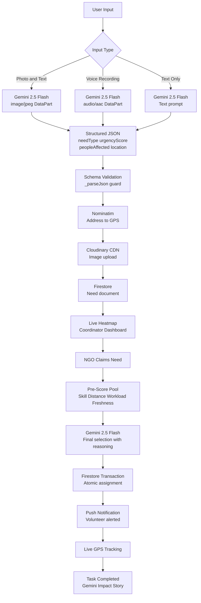
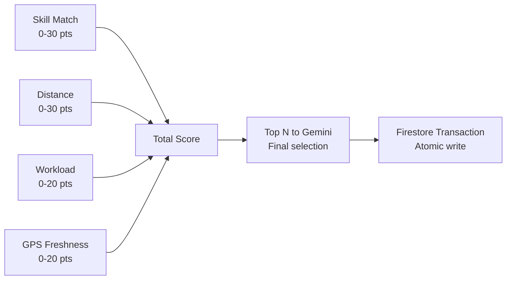
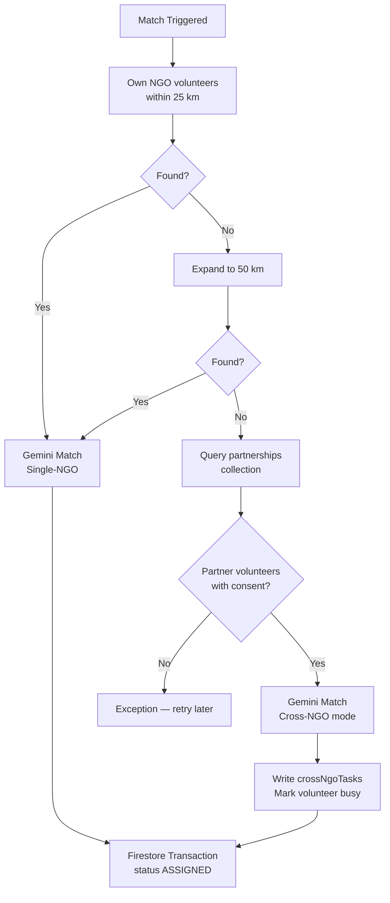
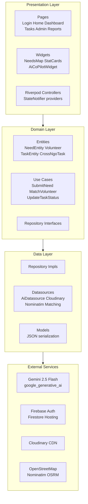

<div align="center">

# SevakAI

**AI-Powered Smart Resource Allocation for Disaster Relief & Volunteer Coordination**

*Google Solution Challenge 2026 — Build with AI*

[](https://flutter.dev)
[](https://ai.google.dev)
[](https://firebase.google.com)
[](https://m3.material.io)
[](https://developers.google.com/community/gdsc-solution-challenge)

</div>

---

## Table of Contents

- [Problem Statement](#problem-statement)
- [Build with AI — Gemini at the Core](#build-with-ai--gemini-at-the-core)
- [UN Sustainable Development Goals](#un-sustainable-development-goals)
- [How It Works](#how-it-works)
- [AI Pipeline](#ai-pipeline)
- [Google Technologies](#google-technologies)
- [Volunteer Matching Engine](#volunteer-matching-engine)
- [Features by Role](#features-by-role)
- [Architecture](#architecture)
- [Project Structure](#project-structure)
- [Tech Stack](#tech-stack)
- [Getting Started](#getting-started)
- [Security](#security)
- [Impact and Scalability](#impact-and-scalability)
- [Future Improvements](#future-improvements)
- [Key Technical Challenge](#key-technical-challenge)
- [Demo](#demo)
- [Team](#team)

---

## Problem Statement

**Smart Resource Allocation — Data-Driven Volunteer Coordination for Social Impact**

> *Local social groups and NGOs collect important information about community needs through paper surveys and field reports. However, this data is often scattered, making it hard to see the biggest problems clearly.*

During disasters and local emergencies, three bottlenecks block effective response:

| Bottleneck | Real-World Impact |
|---|---|
| **Fragmented Triage** | First responders waste 2–5 minutes on manual forms during active crises. Reports scatter across WhatsApp groups and paper registers. |
| **NGO Silos** | Multiple NGOs operate in the same city blind to each other — duplicate food deliveries happen while medical emergencies go unaddressed. |
| **No Smart Matching** | There is no system to connect the *right* volunteer — by skill, proximity, and workload — to a specific, time-critical need. |

**SevakAI eliminates all three** through a unified, Gemini-first platform that triages unstructured reports in seconds and autonomously dispatches the most suitable volunteers.

---

## Build with AI — Gemini at the Core

Gemini is not a feature add-on. It is the **reasoning engine** for every critical workflow.

### 5 Gemini-Powered Capabilities

| Capability | What Gemini Does |
|---|---|
| **Multimodal Emergency Triage** | Receives a photo + text description. Returns `needType`, `urgencyScore` (0–100), `peopleAffected`, `location`, and `scaleAssessment` as structured JSON — no manual forms. |
| **Voice Emergency Analysis** | Accepts audio recordings as `audio/aac` DataParts. Transcribes, translates Hindi/Urdu to English, and triages in one call. |
| **Volunteer Matching** | Given a pre-scored candidate pool, selects the optimal volunteer(s) with load-balancing logic and a natural-language `matchReason` stored in Firestore. |
| **AI Co-Pilot (Field Chat)** | Volunteers chat with Gemini at the scene from the Task Detail page. Gemini responds with protocol-based first-aid and shelter guidance under 50 words, with life-threat disclaimers. |
| **Impact Story Generation** | On task completion, Gemini generates a donor-facing `headline` + 3-paragraph `story` from raw outcome notes, saved to the `impactStories` collection. |

---

## UN Sustainable Development Goals

| SDG | SevakAI Contribution |
|:---:|---|
| **SDG 3 — Good Health & Well-Being** | Gemini classifies `MEDICAL` needs and matches volunteers with first-aid, nursing, and paramedic skills from the `skillToNeedTypes` map — accelerating medical dispatch from 30+ minutes to under 60 seconds. |
| **SDG 11 — Sustainable Cities & Communities** | Real-time urgency heatmap across all participating NGOs prevents duplication and blind spots. No neighbourhood is overlooked. |
| **SDG 17 — Partnerships for the Goals** | Cross-NGO Escalation Engine breaks organizational silos in code — automatically borrowing consenting volunteers from partner NGOs when capacity runs out. |

---

## How It Works

```
Snap / Record  →  Gemini Triage  →  Live Map  →  NGO Claims  →  Gemini Match  →  Track  →  Resolve
```

1. **Snap or Record** — Photo, voice note, or typed text. No long forms during a crisis.
2. **Gemini Triage** — `gemini-2.5-flash` returns structured JSON with `needType`, `urgencyScore`, `peopleAffected`, `location`, and `scaleAssessment`.
3. **AI Analysis Review** — User reviews AI output on `NeedConfirmationPage` and submits to Firestore.
4. **Live Heatmap** — Pin appears on coordinators' maps: red (Critical 80+), amber (Urgent 50–79), green (Moderate below 50). Auto-clusters at zoom-out.
5. **Claim** — Coordinator claims the need for their NGO — atomic Firestore write prevents duplicate dispatch.
6. **Gemini Match** — Matching engine pre-scores candidates (Skill + Distance + Workload + GPS Freshness), sends top pool to Gemini for final pick with reasoning.
7. **Cross-NGO Escalation** — Zero local volunteers? Engine queries `partnerships` collection and borrows a consenting partner-NGO volunteer automatically.
8. **Track and Co-Pilot** — Volunteer navigates with live GPS; `AiCoPilotWidget` provides Gemini field guidance.
9. **Resolve** — Task marked complete; Gemini generates impact story saved to Firestore.

---

## AI Pipeline



---

## Google Technologies

### Gemini 2.5 Flash

| Feature | SDK Usage |
|---|---|
| Emergency triage | `Content.multi([TextPart, DataPart('image/jpeg',...)])` |
| Voice analysis | `Content.multi([TextPart, DataPart('audio/aac',...)])` |
| Volunteer matching | `Content.text(prompt)` with pre-scored JSON |
| Co-Pilot chat | `generateCoPilotResponse()` in `AiDatasource` |
| Impact stories | `generateImpactStory()` → saved to `impactStories` collection |

### Firebase Authentication
- Email/Password + Google Sign-In via `firebase_auth`
- 5-tier RBAC: SA, NA, CO, VL, CU — stored in Firestore `volunteers` collection
- Role reconciliation on every login (SA check → existing profile → default CU)

### Cloud Firestore
- Real-time streaming for heatmap, tasks, reports
- `runTransaction()` for race-condition-proof volunteer assignment
- 10 collections, 147-line production security ruleset

### Flutter + Material 3 + Google Fonts
- Single codebase: Android APK + Firebase Hosting (Web)
- Full M3: `ColorScheme.fromSeed()`, `useMaterial3: true`, 20+ component overrides
- Roboto across all 11 M3 type scale styles via `google_fonts`

### WorkManager
- Background GPS sync every 1 hour in an isolated Dart isolate — zero UI thread impact

---

## Volunteer Matching Engine

### Pre-Score Formula (0–100 pts)



**Scoring rules:**
- **Skill Match:** Exact match via `skillToNeedTypes` map (e.g. `first aid` → `MEDICAL`) = 30 pts
- **Distance:** Haversine linear decay from 25 km radius
- **Workload:** `(1 - activeTasks/maxTasks) * 20` — prevents volunteer burnout
- **GPS Freshness:** Under 15 min = 20 pts, under 1 hr = 15, under 2 hr = 10, stale = 5

### Escalation Logic



---

## Features by Role

### Community User
- Submit reports via camera, voice note, or text — no manual forms
- Gemini auto-fills: category, urgency score, affected count, location
- Review on `NeedConfirmationPage` ("AI Analysis Result") before submitting
- Track status in real time: `RAW` → `SCORED` → `ASSIGNED` → `COMPLETED`

### Volunteer
- Push notifications on assignment via `flutter_local_notifications`
- Task Detail: urgency badge, Gemini description, photo, GPS, people affected
- Accept / Decline — `rejectedBy` array prevents re-assignment
- Navigate via Google Maps deep-link (`url_launcher`)
- **AI Co-Pilot** — Gemini chat widget for real-time field guidance
- Complete task with notes + optional completion photo; Gemini generates impact story
- Cross-NGO badge shown when task sourced from partner NGO

### Coordinator
- Real-time urgency heatmap with marker clustering
- Toggle between own-NGO view and global city-wide view
- Claim needs — prevents duplicate NGO dispatch
- `NeedDetailPanel`: Gemini urgency reason, scale assessment, vulnerable groups
- "Find Best Volunteer" — triggers Gemini autonomous matching
- Stat cards: Active Needs, Available Volunteers, Resolved Today

### NGO Admin
- Generate single-use invite codes for onboarding
- Approve / reject join requests
- Manage NGO partnerships with skill-sharing configuration

### Super Admin
- Platform-wide NGO approval / rejection
- Manage `platformConfig/superAdmins` list
- Global needs visibility across all NGOs

---

## Architecture



---

## Project Structure

```
Sevak-AI/
├── README.md
├── PROJECT_IDEA.md
├── mvp_roadmap.md
└── sevak_app/
    ├── lib/
    │   ├── main.dart                # Firebase, WorkManager, Notifications init
    │   ├── app.dart                 # GoRouter + role-based redirect guards
    │   ├── core/
    │   │   ├── config/env_config.dart          # API keys and model identifiers
    │   │   ├── constants/app_constants.dart    # Collections, radii, skillToNeedTypes
    │   │   ├── constants/role_definitions.dart # PlatformRole enum + extensions
    │   │   ├── theme/app_theme.dart            # Full M3 theme (471 lines)
    │   │   └── utils/image_compressor.dart     # Isolate-based JPEG compression
    │   └── features/
    │       ├── auth/          # Login, Register, Profile Setup, Google Sign-In
    │       ├── community_reports/ # CU dashboard and report submission
    │       ├── dashboard/     # Coordinator heatmap, stat cards, admin pages
    │       ├── home/          # Role-adaptive home screen
    │       ├── location/      # GPS service, OSRM routing, live tracking
    │       ├── matching/      # MatchVolunteerUseCase, MatchingAiDatasource
    │       ├── needs/         # AI triage: AiDatasource, Cloudinary, Nominatim
    │       ├── ngos/          # NGO discovery and registration
    │       ├── partnerships/  # Cross-NGO partnership management
    │       └── tasks/         # TaskDetailPage, AiCoPilotWidget, notifications
    ├── firestore.rules        # 147-line production security rules
    ├── pubspec.yaml           # 40+ pinned dependencies
    └── .env.example           # Environment variable template
```

---

## Tech Stack

| Category | Technology | Purpose |
|---|---|---|
| Frontend | Flutter 3.6+ | Android APK + Web (single codebase) |
| Design | Material 3 + Google Fonts Roboto | Google's latest design system |
| AI | Gemini 2.5 Flash (`google_generative_ai`) | Triage, matching, Co-Pilot, stories |
| Backend | Cloud Firestore | Real-time NoSQL, atomic transactions |
| Auth | Firebase Auth + Google Sign-In | Email/Password + one-tap Google |
| Hosting | Firebase Hosting | Flutter Web deployment |
| Maps | flutter_map + OpenStreetMap | Zero-cost global mapping |
| Geocoding | Nominatim API | Address to GPS |
| Routing | OSRM | Turn-by-turn polylines |
| Images | Cloudinary CDN + flutter_image_compress | Upload and compression |
| State | Riverpod 2.6 | Compile-safe dependency injection |
| Navigation | GoRouter | RBAC redirect guards |
| Background | WorkManager | Periodic GPS in isolated isolate |
| Notifications | flutter_local_notifications | Push alerts on task assignment |
| Location | Geolocator | High-accuracy GPS, 10 m live stream |
| Audio | record package | Voice note capture for Gemini |

---

## Getting Started

### Prerequisites
- Flutter SDK `>=3.6.0`
- Firebase CLI — `npm install -g firebase-tools`
- [Gemini API Key](https://aistudio.google.com) (free tier)
- [Cloudinary](https://cloudinary.com) account (free tier)

### Install

```bash
git clone https://github.com/ayanokojix21/Sevak-AI.git
cd Sevak-AI/sevak_app
flutter pub get
cp .env.example .env    # fill in your keys
```

### `.env`

```env
GEMINI_API_KEY=your_gemini_api_key
CLOUDINARY_CLOUD_NAME=your_cloud_name
CLOUDINARY_API_KEY=your_cloudinary_key
CLOUDINARY_API_SECRET=your_cloudinary_secret
```

### Firebase

```bash
firebase login
flutterfire configure          # generates firebase_options.dart
# copy google-services.json → android/app/
```

Enable in Firebase Console → Authentication: **Email/Password** and **Google**.

### Run

```bash
flutter run                    # Android
flutter run -d chrome          # Web
flutter build apk --release --obfuscate --split-debug-info=build/debug-info
flutter build web && firebase deploy --only hosting
```

### Demo Credentials for Judges

| Role | How to Access |
|---|---|
| Community User | Sign up with any email — default role |
| Volunteer / Coordinator | Sign up → redeem an NGO invite code |
| NGO Admin | Super Admin approves the NGO registration |
| Super Admin | Email in Firestore `platformConfig/superAdmins` |

---

## Security

| Layer | Detail |
|---|---|
| Firestore Rules | 147-line ruleset — volunteers own their doc, needs scoped to NGO, partnerships require dual consent |
| API Keys | Stored in `.env` (gitignored), never hardcoded |
| Gemini Output Validation | `_parseJson()` validates schema before every Firestore write |
| Atomic Transactions | `runTransaction()` prevents concurrent double-assignment |
| Code Obfuscation | `--obfuscate --split-debug-info` + ProGuard on release builds |

---

## Impact and Scalability

| Metric | Without SevakAI | With SevakAI |
|---|---|---|
| Emergency report time | 2–5 min (manual) | Under 10 sec (Gemini auto-triage) |
| Volunteer dispatch | 30+ min (phone calls) | Under 60 sec (autonomous matching) |
| Cross-NGO coordination | Non-existent | Automated escalation via partnerships |
| Duplicate responses | Common | Eliminated via claim system |
| Multilingual support | None | Hindi/Urdu audio auto-translated by Gemini |
| Data visibility | Fragmented (WhatsApp/paper) | Unified real-time heatmap |

**Scale dimensions:**
- Any city — OpenStreetMap works globally at zero cost
- Any language — Gemini handles 40+ languages natively
- New NGOs — self-service registration + invite codes
- New skills — one line added to `AppConstants.skillToNeedTypes`

---

## Future Improvements

These features are designed and planned in the project roadmap but not yet implemented:

### Offline-First Triage
Allow field workers in low-connectivity areas to capture reports offline and sync when connectivity is restored using Firestore offline persistence and local queuing.

### Service Rating System
After need resolution, community users receive a 1–5 star rating prompt for the volunteer response. Ratings feed back into the matching engine's pre-score over time.

### Gemini Predictive Resource Planning
Use historical need data stored in Firestore to generate weekly predictive reports for NGO Admins — forecasting which need types and neighbourhoods are likely to spike, enabling pre-positioning of volunteers.

### Firebase Cloud Messaging (FCM) Integration
Replace foreground Firestore listeners with FCM push notifications so volunteers receive task alerts even when the app is fully closed (currently requires the app to be in the foreground/background).

### Volunteer Availability Scheduling
Allow volunteers to set available hours and days. The matching engine filters only volunteers currently within their scheduled window, reducing declined tasks.

### In-App Impact Dashboard for Donors
A shareable, public-facing page per NGO showing cumulative impact metrics — total needs resolved, volunteer hours contributed, people helped — powered by Gemini-generated impact stories aggregated from `impactStories` collection.

### Multi-Language UI
Full Flutter localization (`flutter_localizations`) with Hindi support for community users in rural areas, complementing Gemini's existing multilingual voice understanding.

### Community User Push Notifications
Store FCM token at report submission and notify community users when their need is assigned and completed — closing the feedback loop for reporters.

---

## Key Technical Challenge

**Problem:** Multimodal AI triage must be reliable in disaster scenarios — any AI failure is unacceptable when routing emergency resources.

**Solution:** Every Gemini call in `AiDatasource` wraps the response in `_parseJson()` schema validation before writing to Firestore. Invalid or incomplete Gemini responses throw a typed exception caught by the Riverpod `AsyncValue` error state, shown to the user with a retry option rather than silently corrupting Firestore data.

Additionally, the volunteer matching engine validates all AI-returned UIDs against the pre-fetched candidate list — guarding against Gemini hallucinating volunteer IDs not in the system.

---

## Demo

> **Live Demo Video:** [Watch on YouTube](https://youtube.com/your-demo-link)
>
> *Flow: Community user snaps photo → Gemini extracts urgency and location → pin appears on coordinator heatmap → coordinator claims → Gemini matches volunteer → push notification → live GPS tracking → task completed → Gemini impact story*

---

## Team

| Member | Contribution |
|---|---|
| **[Your Name]** | Gemini AI pipeline, matching engine, M3 UI, Firebase architecture |
| *(Add teammates)* | — |

**Institution:** [Your College / University]  
**GDG Chapter:** [Your GDG on Campus Chapter]  
**Country:** India

---

<div align="center">

**Google Solution Challenge 2026 — Build with AI**

Flutter · Firebase · Gemini 2.5 Flash · Material 3 · Google Fonts

*Addressing UN SDGs 3, 11, and 17 through Gemini-powered volunteer coordination*

</div>
