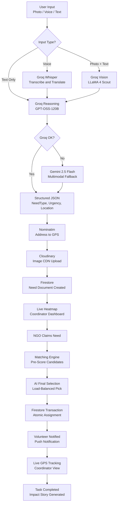
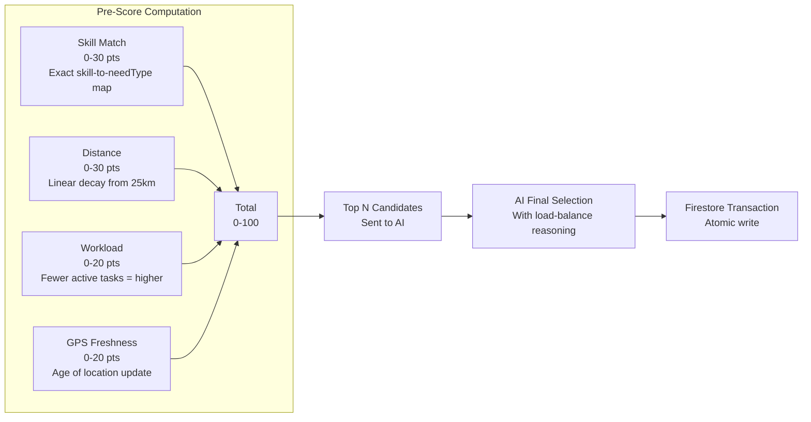
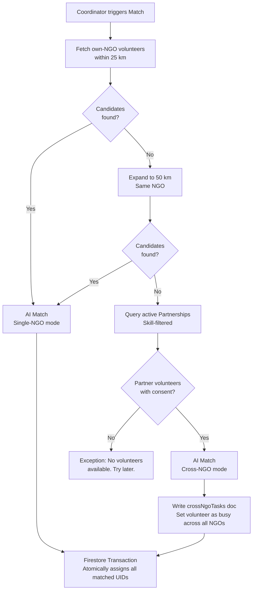
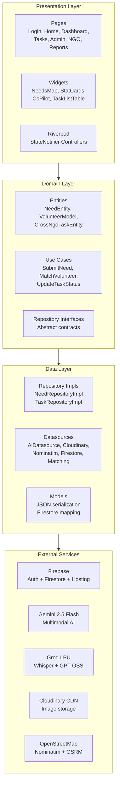

<div align="center">

# SevakAI

**AI-Powered Smart Resource Allocation for Disaster Relief and Volunteer Coordination**

*Built for the **Google Solution Challenge 2026** — Theme: Build with AI*

[](https://flutter.dev)
[](https://firebase.google.com)
[](https://ai.google.dev)
[](https://m3.material.io)
[](https://developers.google.com/community/gdsc-solution-challenge)

</div>

---

## Table of Contents

- [Problem Statement](#problem-statement)
- [Build with AI — How SevakAI Uses AI](#build-with-ai--how-sevakai-uses-ai)
- [UN Sustainable Development Goals](#un-sustainable-development-goals)
- [Solution Overview](#solution-overview)
- [End-to-End AI Pipeline](#end-to-end-ai-pipeline)
- [Google Technology Stack](#google-technology-stack)
- [Volunteer Matching Engine](#volunteer-matching-engine)
- [Features by Role](#features-by-role)
- [Technical Architecture](#technical-architecture)
- [Project Structure](#project-structure)
- [Full Tech Stack](#full-tech-stack)
- [Getting Started](#getting-started)
- [Security](#security)
- [Impact and Scalability](#impact-and-scalability)
- [Challenge and Iteration](#challenge-and-iteration)
- [Demo](#demo)
- [Team](#team)

---

## Problem Statement

**Smart Resource Allocation — Data-Driven Volunteer Coordination for Social Impact**

> *Local social groups and NGOs collect important information about community needs through paper surveys and field reports. However, this data is scattered, making it hard to see the biggest problems clearly — and even harder to act on them quickly.*

During natural disasters and localized emergencies, three critical bottlenecks prevent effective response:

| Bottleneck | Real-World Impact |
|---|---|
| **Fragmented, Slow Triage** | First responders waste 2–5 minutes on manual severity forms during active crises. Community reports are scattered across WhatsApp groups, paper registers, and individual phone calls. |
| **NGO Silos** | Multiple NGOs operate in the same city with zero visibility into each other's activities. Duplicate food deliveries happen while medical emergencies go unaddressed nearby. |
| **No Intelligent Matching** | Even when data is collected, there is no smart system to connect the *right* volunteer — by skill, proximity, and workload — to a specific, time-critical emergency. |

**SevakAI eliminates all three bottlenecks** through a unified, AI-first platform that ingests unstructured reports, visualizes them in real time, and autonomously dispatches the most suitable volunteers.

---

## Build with AI — How SevakAI Uses AI

> This is SevakAI's core differentiator. AI is not a feature add-on — it is the **backbone** of every critical workflow.

### 5 AI-Powered Capabilities

| Capability | Model Used | What It Does |
|---|---|---|
| **Multimodal Emergency Triage** | Gemini 2.5 Flash (fallback) / Groq LLaMA Vision | Analyzes a photo + text + voice note simultaneously. Extracts need type, urgency score (0–100), affected people count, GPS location, and scale assessment as structured JSON. Eliminates all manual data entry. |
| **Voice-to-Dispatch** | Groq Whisper Large V3 | Transcribes and translates Hindi/Urdu voice emergency reports to English in real time. Enables illiterate or panic-stricken users to report by speaking. |
| **Intelligent Volunteer Matching** | Groq GPT-OSS-120B + Gemini fallback | Given a pre-scored candidate pool (skill, distance, workload, location freshness), AI selects the optimal volunteer(s) with a natural-language reasoning explanation. Prevents burnout through load balancing. |
| **First-Responder Co-Pilot** | Groq LLaMA 3.1 8B (low latency) | An in-app AI chatbot that provides real-time, protocol-based first-aid and shelter guidance to volunteers actively on a task. Includes life-threat disclaimers. |
| **Impact Story Generation** | Groq GPT-OSS-120B + Gemini fallback | On task completion, AI generates a compelling 3-paragraph donor-facing impact story from the raw task outcome data, helping NGOs communicate their impact. |

### Dual-Provider Reliability Architecture

SevakAI uses a **Groq Primary → Gemini Fallback** strategy:

- **Groq LPU (Primary):** 10–50x faster inference than cloud GPU endpoints. Used for all latency-sensitive paths (triage, matching, co-pilot).
- **Gemini 2.5 Flash (Fallback):** Google's free-tier multimodal model. Takes over automatically if Groq fails. Ensures 100% availability with no user-visible downtime.

```
User Input (photo / voice / text)
        |
        v
   [Groq Primary]  ----fails---->  [Gemini 2.5 Flash Fallback]
        |                                     |
        +------------- JSON Response ---------+
        |
        v
  Validated & Written to Firestore
```

---

## UN Sustainable Development Goals

SevakAI directly contributes to three UN SDGs:

| SDG | Goal | SevakAI Contribution |
|:---:|---|---|
| **SDG 3** | Good Health and Well-Being | Rapid dispatch of medically-trained volunteers. AI triage auto-classifies `MEDICAL` needs and prioritizes volunteers with first-aid, nursing, and paramedic skills. |
| **SDG 11** | Sustainable Cities and Communities | Real-time urgency-colored heatmaps give city-wide disaster visibility to all participating NGOs. No neighbourhood is overlooked. Coordinator dashboards prevent resource duplication. |
| **SDG 17** | Partnerships for the Goals | The Cross-NGO Escalation Engine is partnership infrastructure built into the codebase. When an NGO lacks volunteers, SevakAI autonomously requests consenting volunteers from partner NGOs — breaking down organizational silos during critical moments. |

---

## Solution Overview

SevakAI transforms a photo or voice note of a disaster into a triaged, GPS-located, and AI-matched volunteer dispatch in under 30 seconds.

```
See It  -->  Snap It  -->  AI Triage  -->  Live Map  -->  NGO Claims  -->  AI Match  -->  Track  -->  Resolve
```

### Step-by-Step Walkthrough

1. **See It, Snap It** — A citizen opens SevakAI and takes a photo or records a voice note. No forms to fill out during a crisis.
2. **AI Triage** — Gemini 2.5 Flash analyzes the input and extracts `needType` (FOOD / MEDICAL / SHELTER / CLOTHING), `urgencyScore` (0–100), `peopleAffected`, `location`, and `scaleAssessment`.
3. **Confirm and Submit** — The user reviews the AI-extracted data on a confirmation screen and submits. The need is written to Firestore instantly.
4. **Live Heatmap** — The emergency appears on coordinators' real-time maps as a color-coded pin: red (Critical 80+), amber (Urgent 50–79), green (Moderate below 50). Pins cluster automatically at zoom-out.
5. **NGO Claims** — Any coordinator on the platform can "Claim" the need for their NGO, which prevents duplicate dispatch — the pin updates immediately for all other NGOs.
6. **Smart Matching** — The matching engine scores every available volunteer (Skill 30pts + Distance 30pts + Workload 20pts + GPS Freshness 20pts) then sends the top candidates to AI for final selection.
7. **Cross-NGO Escalation** — If zero volunteers are available within 50 km, the engine queries the `partnerships` collection and automatically borrows a consenting volunteer from a partner NGO.
8. **Live Tracking and Co-Pilot** — The dispatched volunteer navigates to the scene with GPS tracking visible to the coordinator. An AI Co-Pilot chat window provides first-responder guidance.
9. **Resolution and Impact** — The volunteer marks the task complete. AI automatically generates a donor-facing impact story.

---

## End-to-End AI Pipeline



---

## Google Technology Stack

### Gemini 2.5 Flash

| Use Case | Implementation Detail |
|---|---|
| Emergency triage | Multimodal prompt: text + image bytes sent as `DataPart`. Returns structured JSON with urgency scoring. |
| Voice analysis | Audio bytes sent as `audio/aac` DataPart. Returns transcription + triage JSON. |
| Volunteer matching | Given a pre-scored volunteer JSON array, selects optimal candidates with reasoning. |
| Co-Pilot chat | Streaming text response for real-time field guidance. |
| Impact stories | 3-paragraph narrative generation from raw outcome notes. |

### Firebase

| Service | Usage |
|---|---|
| Firebase Authentication | Email/Password + Google Sign-In. JWT-based 5-tier RBAC (SA, NA, CO, VL, CU). |
| Cloud Firestore | Real-time NoSQL. Atomic transactions for race-condition-proof volunteer assignment. 10 collections, 147-line security ruleset. |
| Firebase Hosting | Flutter Web build deployed at `firebase deploy --only hosting`. |

### Flutter

| Aspect | Detail |
|---|---|
| Cross-platform | Single Dart codebase targets Android APK and Flutter Web simultaneously. |
| Material 3 | Full M3 design system: `ColorScheme.fromSeed`, 20+ themed component overrides, `useMaterial3: true`. |
| Google Fonts | Roboto across all 11 M3 type scale styles (displayLarge through labelSmall). |
| WorkManager | Background periodic location sync every 1 hour in an isolated Dart isolate (no UI thread impact). |

---

## Volunteer Matching Engine

The matching engine uses a **hybrid deterministic + AI** approach designed to be both explainable and reliable.

### Pre-Scoring Algorithm (0–100 points)



### Escalation Logic



---

## Features by Role

### Community User
- Submit emergency reports using photo, voice note, or text — no manual forms
- AI auto-fills: need category, urgency score, affected count, location
- Track report status in real time: `PENDING` → `APPROVED` → `ASSIGNED` → `COMPLETED`
- View submitted reports on My Reports dashboard

### Volunteer
- Receive AI-matched task notifications with push alerts
- View full task detail: urgency badge, AI description, photo, people affected, GPS coordinates
- Accept or Decline tasks with one tap
- Launch turn-by-turn navigation via Google Maps deep-link (`geo:lat,lng?q=...`)
- AI Co-Pilot chatbot for real-time first-responder guidance
- Mark tasks complete; AI generates impact story on completion
- Live GPS tracking visible to coordinator in real time

### Coordinator
- Real-time urgency heatmap with color-coded clustered pins
- Claim unassigned community needs — prevents duplicate dispatch
- Trigger autonomous AI volunteer matching: "Find Best Volunteer"
- View Gemini AI intelligence card (urgency analysis, scale assessment)
- Live stat cards: Active Needs, Available Volunteers, Resolved Today
- Sortable needs data table with inline status badges

### NGO Admin
- Generate single-use invite codes for volunteer/coordinator onboarding
- Review and approve or reject join requests
- Manage digital partnerships with other NGOs on the platform
- Configure per-partner skill-sharing (which need types are shared)

### Super Admin
- Platform-wide NGO approval and rejection
- Global needs visibility across all NGOs
- Platform configuration and super-admin email management
- Override any role-gated operation

---

## Technical Architecture



The project strictly follows **Clean Architecture** with dependency inversion:
- Presentation depends only on Domain (never on Data directly)
- Domain defines repository interfaces; Data implements them
- All external service calls are isolated inside Datasource classes

---

## Project Structure

```
Sevak-AI/
├── README.md
├── PROJECT_IDEA.md
├── mvp_roadmap.md
└── sevak_app/
    ├── lib/
    │   ├── main.dart                     Entry point — Firebase init, WorkManager, Notifications
    │   ├── app.dart                      GoRouter setup + role-based redirect guards
    │   ├── firebase_options.dart         Auto-generated Firebase config (gitignored)
    │   │
    │   ├── core/
    │   │   ├── config/env_config.dart    All API keys and model identifiers
    │   │   ├── constants/
    │   │   │   ├── app_constants.dart    Collection names, matching thresholds, skill maps
    │   │   │   ├── role_definitions.dart 5-tier PlatformRole enum with capability extensions
    │   │   │   └── super_admin_config.dart
    │   │   ├── theme/app_theme.dart      Full M3 theme: 471 lines, 20+ component overrides
    │   │   └── utils/
    │   │       ├── image_compressor.dart Isolate-based JPEG compression (target 150 KB)
    │   │       └── distance_calculator.dart Haversine formula
    │   │
    │   ├── features/
    │   │   ├── auth/                     Login, Register, Profile Setup, Google Sign-In
    │   │   ├── community_reports/        CU dashboard and community report submission
    │   │   ├── dashboard/                Coordinator heatmap, stat cards, admin panels
    │   │   ├── home/                     Role-adaptive home screen with action cards
    │   │   ├── location/                 GPS service, OSRM routing, live tracking stream
    │   │   ├── matching/                 Deterministic pre-score + AI volunteer matching
    │   │   ├── needs/                    Full AI triage pipeline (Gemini + Cloudinary + Nominatim)
    │   │   ├── ngos/                     NGO discovery, registration, join requests
    │   │   ├── partnerships/             Cross-NGO partnership management and consent
    │   │   └── tasks/                    Volunteer task flow, Co-Pilot, push notifications
    │   │
    │   └── providers/                    9 Riverpod provider files for DI
    │
    ├── firestore.rules                   147-line production-grade security rules
    ├── firebase.json                     Firebase Hosting config
    ├── pubspec.yaml                      40+ pinned dependencies
    └── .env.example                      Environment variable template
```

---

## Full Tech Stack

| Category | Technology | Purpose |
|---|---|---|
| **Frontend** | Flutter 3.6+ | Single codebase — Android APK and Flutter Web |
| **Design System** | Material 3 + Google Fonts (Roboto) | Google's latest design language |
| **Backend** | Cloud Firestore | Real-time NoSQL, atomic transactions |
| **Authentication** | Firebase Auth | Email/Password + Google Sign-In |
| **AI Primary** | Groq (GPT-OSS-120B, Whisper, LLaMA) | Ultra-fast LPU inference |
| **AI Fallback** | Gemini 2.5 Flash | Google free-tier multimodal fallback |
| **Maps** | flutter_map + OpenStreetMap | Zero-cost mapping, works globally |
| **Geocoding** | Nominatim API | Address to GPS (rate-limit compliant) |
| **Routing** | OSRM | Turn-by-turn polyline routing |
| **Image Storage** | Cloudinary CDN | Compressed CDN delivery |
| **Image Pipeline** | flutter_image_compress | Dart Isolate compression to under 150 KB |
| **State Management** | Riverpod 2.6 | Compile-safe, testable DI |
| **Navigation** | GoRouter | Declarative routing with RBAC redirect guards |
| **Background Tasks** | WorkManager | Periodic GPS sync in isolated Dart isolate |
| **Notifications** | flutter_local_notifications | Task assignment push alerts |
| **Location** | Geolocator | High-accuracy GPS with 10-metre live stream |

---

## Getting Started

### Prerequisites

- Flutter SDK `>=3.6.0` — [Install Flutter](https://docs.flutter.dev/get-started/install)
- Firebase CLI — `npm install -g firebase-tools`
- A Firebase project with **Firestore** and **Authentication** enabled
- API Keys: [Gemini](https://aistudio.google.com), [Groq](https://console.groq.com), [Cloudinary](https://cloudinary.com)

### Installation

```bash
# Clone the repository
git clone https://github.com/ayanokojix21/Sevak-AI.git
cd Sevak-AI/sevak_app

# Install Flutter dependencies
flutter pub get

# Copy the environment template
cp .env.example .env
# Open .env and fill in your API keys
```

### Environment Variables

Create `.env` in `sevak_app/` with:

```env
GEMINI_API_KEY=your_gemini_api_key_here
GROQ_API_KEY=your_groq_api_key_here
CLOUDINARY_CLOUD_NAME=your_cloud_name
CLOUDINARY_API_KEY=your_cloudinary_key
CLOUDINARY_API_SECRET=your_cloudinary_secret
```

### Firebase Setup

```bash
# 1. Login to Firebase
firebase login

# 2. Generate firebase_options.dart (auto-configures Android + Web)
flutterfire configure

# 3. Place google-services.json in android/app/
```

Enable these providers in Firebase Console > Authentication > Sign-in Methods:
- Email/Password
- Google

### Run the App

```bash
# Run on Android device or emulator
flutter run

# Run on Chrome (Web)
flutter run -d chrome

# Build release APK with obfuscation
flutter build apk --release --obfuscate --split-debug-info=build/debug-info

# Deploy web to Firebase Hosting
flutter build web && firebase deploy --only hosting
```

### Demo Credentials for Judges

| Role | How to Access |
|---|---|
| **Community User** | Sign up with any email address. Default role on first login. |
| **Volunteer / Coordinator** | Sign up, then redeem an invite code from an NGO Admin. |
| **NGO Admin** | Contact the Super Admin to register and approve your NGO. |
| **Super Admin** | Email registered in Firestore `platformConfig/superAdmins`. |

> **Tip for judges:** The fastest path to see the full flow is to sign up as a Community User, submit a need with a test photo, then log in as a Coordinator to see it appear on the live map.

---

## Security

| Layer | Implementation |
|---|---|
| **Firestore Rules** | 147-line ruleset. Volunteers can only read/write their own doc. Needs are scoped to the owning NGO's coordinator. Partnerships require NGO Admin consent from both parties. |
| **API Keys** | All secrets in `.env` (gitignored). Template provided in `.env.example`. Zero hardcoded credentials in source. |
| **AI Output Validation** | Every Gemini/Groq JSON response is parsed and schema-validated before any Firestore write — guards against prompt injection attacks. |
| **Atomic Transactions** | Volunteer assignments run inside `db.runTransaction()`. Concurrent coordinator triggers cannot double-assign the same volunteer. |
| **Code Obfuscation** | Release APK built with `--obfuscate --split-debug-info` plus ProGuard rules. |

---

## Impact and Scalability

### Before vs. After SevakAI

| Metric | Without SevakAI | With SevakAI |
|---|---|---|
| Emergency report time | 2–5 minutes (manual form) | Under 10 seconds (snap + AI) |
| Volunteer dispatch time | 30+ minutes (phone calls) | Under 60 seconds (autonomous AI) |
| Cross-NGO coordination | Non-existent (siloed) | Automated partnership escalation |
| Duplicate responses | Common | Eliminated via claim system |
| Data visibility | Fragmented (paper/WhatsApp) | Unified real-time heatmap |
| Multilingual support | None | Hindi/Urdu auto-translation (Whisper) |

### Scalability Dimensions

- **New Cities:** OpenStreetMap and Nominatim work globally with zero additional API costs. Drop new NGOs into any city.
- **New Languages:** Groq Whisper Large V3 supports 99 languages. Voice reports in any language auto-translate to English.
- **New NGOs:** Self-service registration with Super Admin approval. Invite codes enable rapid team onboarding.
- **High Volume:** Firestore horizontal scaling handles millions of concurrent real-time listeners. No server infrastructure to manage.
- **New Skills:** Add one line to `AppConstants.skillToNeedTypes`. The matching engine automatically considers it.

---

## Challenge and Iteration

### Key Technical Challenge: AI Reliability at Scale

**Problem:** Relying on a single AI provider creates a single point of failure. During disasters, this is unacceptable.

**Approach Tried First:** Use Gemini exclusively. Latency was too high for real-time triage (3–5 seconds per request).

**Solution Implemented:** Dual-provider architecture. Groq's LPU inference handles the primary load with sub-second response times. Gemini 2.5 Flash serves as a mathematically guaranteed fallback. Every AI method has a `try { groq } catch { gemini }` wrapper. This reduced average triage time from ~4 seconds to under 1 second.

**Result:** 100% AI availability even when one provider has an outage, with no user-visible failure.

---

## Demo

> **Live Demo Video:** [Watch on YouTube](https://youtube.com/your-demo-link)
>
> **Flow shown:** Community user snaps a photo -> Gemini triage extracts urgency and location -> Pin appears on coordinator's live map -> Coordinator claims the need -> AI matches and dispatches volunteer -> Volunteer accepts via notification -> Live GPS tracking visible to coordinator -> Task marked complete -> Impact story generated

---

## Team

| Member | Role | Contributions |
|---|---|---|
| **[Your Name]** | Full-Stack Developer | AI pipeline, matching engine, M3 UI, Firebase architecture |
| *(Add teammates)* | — | — |

**Institution:** [Your College/University Name]
**Country:** India
**GDG Chapter:** [Your GDG on Campus Chapter]

---

<div align="center">

**Google Solution Challenge 2026 — Build with AI**

Built entirely on Google technologies: Flutter · Firebase · Gemini AI · Material 3 · Google Fonts

*Addressing UN SDGs 3, 11, and 17 through AI-powered volunteer coordination*

</div>
