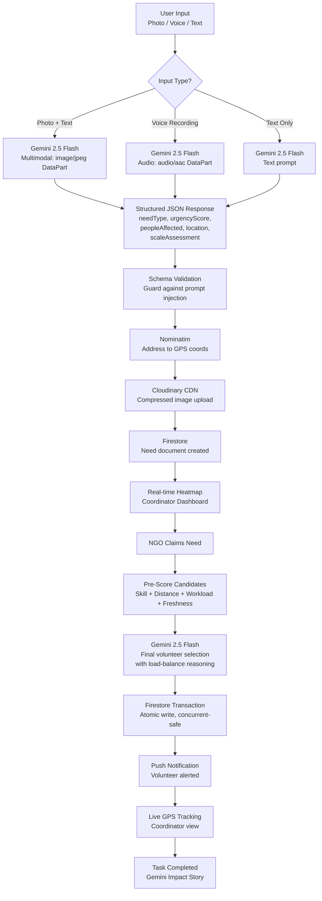
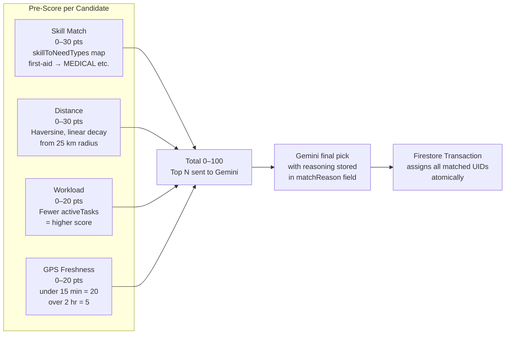
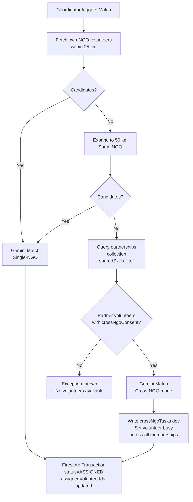
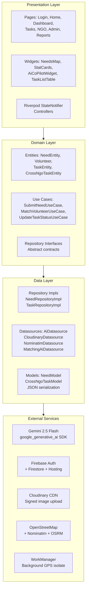

<div align="center">

# SevakAI

**AI-Powered Smart Resource Allocation for Disaster Relief & Volunteer Coordination**

*Google Solution Challenge 2026 — Build with AI*

[](https://flutter.dev)
[](https://ai.google.dev)
[](https://firebase.google.com)
[](https://m3.material.io)
[](https://developers.google.com/community/gdsc-solution-challenge)

</div>

---

## Table of Contents

- [Problem Statement](#problem-statement)
- [Build with AI — Gemini at the Core](#build-with-ai--gemini-at-the-core)
- [UN Sustainable Development Goals](#un-sustainable-development-goals)
- [How It Works](#how-it-works)
- [AI Pipeline](#ai-pipeline)
- [Google Technologies Used](#google-technologies-used)
- [Volunteer Matching Engine](#volunteer-matching-engine)
- [Features by Role](#features-by-role)
- [Architecture](#architecture)
- [Project Structure](#project-structure)
- [Tech Stack](#tech-stack)
- [Getting Started](#getting-started)
- [Security](#security)
- [Impact & Scalability](#impact--scalability)
- [Key Technical Challenge](#key-technical-challenge)
- [Demo](#demo)
- [Team](#team)

---

## Problem Statement

**Smart Resource Allocation — Data-Driven Volunteer Coordination for Social Impact**

> *Local social groups and NGOs collect important information about community needs through paper surveys and field reports. However, this data is often scattered, making it hard to see the biggest problems clearly.*

During natural disasters and localized emergencies, three bottlenecks prevent effective response:

| Bottleneck | Real-World Impact |
|---|---|
| **Fragmented, Slow Triage** | First responders waste 2–5 minutes on manual severity forms. Community reports are scattered across WhatsApp groups and paper registers. |
| **NGO Silos** | Multiple NGOs operate in the same city with zero visibility into each other's activities. Duplicate food deliveries happen while medical emergencies go unaddressed nearby. |
| **No Intelligent Matching** | Even when data is collected, there is no system to connect the *right* volunteer — by skill, proximity, and workload — to a specific, time-critical emergency. |

**SevakAI eliminates all three** through a unified, Gemini-first platform that ingests unstructured reports, visualizes them in real time, and autonomously dispatches the most suitable volunteers.

---

## Build with AI — Gemini at the Core

> Gemini is not a feature add-on in SevakAI. It is the **core reasoning engine** for every critical workflow.

### 5 Gemini-Powered Capabilities

| Capability | Gemini Model | What It Does |
|---|---|---|
| **Multimodal Emergency Triage** | `gemini-2.5-flash` | Receives a photo + text description of a disaster scene. Extracts `needType`, `urgencyScore` (0–100), `peopleAffected`, `location`, and a full `scaleAssessment` — eliminating all manual data entry. |
| **Voice Emergency Analysis** | `gemini-2.5-flash` (audio) | Accepts audio recordings as `audio/aac` DataParts. Transcribes, translates (Hindi/Urdu → English), and triages the emergency in one call. Enables illiterate or panic-stricken users to report by speaking. |
| **AI Volunteer Matching** | `gemini-2.5-flash` | Given a pre-scored candidate pool, Gemini selects the optimal volunteer(s) with load-balancing logic and a natural-language reasoning explanation stored in `matchReason`. |
| **First-Responder Co-Pilot** | `gemini-2.5-flash` | An in-app AI chat widget on the Task Detail page. Volunteers ask questions at the scene; Gemini responds with protocol-based first-aid and shelter guidance in under 50 words, with life-threat disclaimers. |
| **Impact Story Generation** | `gemini-2.5-flash` | On task completion, Gemini generates a 3-paragraph donor-facing impact story from the raw outcome notes — helping NGOs communicate their social impact. |

### How Gemini Is Integrated

The entire AI layer uses Google's official `google_generative_ai` Dart SDK:

```dart
// From lib/features/needs/data/datasources/ai_datasource.dart
_geminiModel = GenerativeModel(
  model: 'gemini-2.5-flash',
  apiKey: EnvConfig.geminiApiKey,
);

// Multimodal triage: text + image
final parts = <Part>[
  TextPart(prompt),
  DataPart('image/jpeg', imageBytes),
];
final response = await _geminiModel.generateContent([Content.multi(parts)]);

// Voice analysis: audio DataPart
final parts = <Part>[
  TextPart(prompt),
  DataPart('audio/aac', audioBytes),
];
```

All Gemini responses are validated against expected JSON schemas before any Firestore write, guarding against prompt injection.

---

## UN Sustainable Development Goals

SevakAI directly addresses three UN SDGs:

| SDG | How SevakAI Contributes |
|:---:|---|
| **SDG 3 — Good Health & Well-Being** | Rapid dispatch of medically-trained volunteers. Gemini auto-classifies `MEDICAL` needs and prioritizes volunteers with first-aid, nursing, and paramedic skills from the `skillToNeedTypes` map. |
| **SDG 11 — Sustainable Cities & Communities** | Real-time urgency-colored heatmaps give city-wide disaster visibility to all participating NGOs. The Coordinator Dashboard prevents resource duplication and ensures no neighbourhood is overlooked. |
| **SDG 17 — Partnerships for the Goals** | The Cross-NGO Escalation Engine is partnership infrastructure built into the codebase. When an NGO lacks volunteers, SevakAI autonomously requests consenting volunteers from partner NGOs — breaking silos during critical moments. |

---

## How It Works

```
Snap / Record  →  Gemini Triage  →  Live Map  →  NGO Claims  →  Gemini Match  →  Track  →  Resolve
```

1. **Snap or Record** — A citizen opens SevakAI and takes a photo or records a voice note. No forms.
2. **Gemini Triage** — `gemini-2.5-flash` analyzes the input and returns structured JSON: `needType`, `urgencyScore`, `peopleAffected`, `location`, `scaleAssessment`.
3. **Confirm & Submit** — The user reviews AI-extracted data on the `NeedConfirmationPage` ("AI Analysis Result") and submits to Firestore.
4. **Live Heatmap** — The emergency appears on coordinators' maps as a color-coded pin: red (Critical 80+), amber (Urgent 50–79), green (Moderate below 50). Pins cluster automatically.
5. **NGO Claims** — Any coordinator "Claims" the need for their NGO — the pin updates for all others instantly, preventing duplicate dispatch.
6. **Gemini Matching** — The matching engine scores every available volunteer (Skill 30 + Distance 30 + Workload 20 + GPS Freshness 20 pts), then sends top candidates to Gemini for final selection with reasoning.
7. **Cross-NGO Escalation** — If zero volunteers are available within 50 km, the engine queries the `partnerships` collection and automatically borrows a consenting volunteer from a partner NGO.
8. **Live Tracking & Co-Pilot** — The dispatched volunteer navigates with GPS tracking visible to the coordinator. The AI Co-Pilot widget provides Gemini-powered first-responder guidance.
9. **Resolution & Impact** — Task marked complete; Gemini generates an impact story for donors.

---

## AI Pipeline



---

## Google Technologies Used

### Gemini 2.5 Flash — `google_generative_ai` SDK

| API Surface | Usage in Code |
|---|---|
| `GenerativeModel` | Initialized in `AiDatasource` and `MatchingAiDatasource` with `gemini-2.5-flash` |
| `Content.multi(parts)` | Multimodal triage: `TextPart` + `DataPart('image/jpeg', ...)` |
| `DataPart('audio/aac', ...)` | Voice emergency analysis and transcription |
| `Content.text(prompt)` | Text-only triage, volunteer matching, Co-Pilot chat, impact stories |
| Structured JSON output | Every Gemini call returns strict JSON parsed by `_parseJson()` |

### Firebase Authentication
- Email/Password and Google Sign-In via `firebase_auth`
- 5-tier role system: SA, NA, CO, VL, CU stored in Firestore `volunteers` collection
- Role reconciliation on every login: SA config check → existing profile → default CU

### Cloud Firestore
- Real-time streaming for live heatmap, task updates, community reports
- Atomic `runTransaction()` for volunteer assignment — prevents race conditions
- 10 collections: `needs`, `volunteers`, `ngos`, `ngoInvites`, `joinRequests`, `partnerships`, `crossNgoTasks`, `communityReports`, `platformConfig`, `impactStories`
- 147-line security ruleset with role-based access per collection

### Flutter — Cross-Platform
- Single Dart codebase targeting Android and Web (Firebase Hosting)
- **Material 3** — full `ColorScheme.fromSeed()` with `useMaterial3: true`, 20+ themed component overrides in `app_theme.dart` (471 lines)
- **Google Fonts (Roboto)** — all 11 M3 type scale styles from `displayLarge` to `labelSmall`
- **WorkManager** — background periodic GPS sync every 1 hour in an isolated Dart isolate

### Google Sign-In
- `google_sign_in` package integrated in `AuthRepository`
- One-tap sign-in from the `LoginPage`

---

## Volunteer Matching Engine

### Pre-Scoring (0–100 points)



### Escalation Logic



---

## Features by Role

### Community User
- Submit emergency reports with photo (camera), voice note, or text
- Gemini auto-fills: category, urgency score, affected count, location
- Review AI analysis on `NeedConfirmationPage` before submitting
- Track report status: `RAW` → `SCORED` → `ASSIGNED` → `IN_PROGRESS` → `COMPLETED`
- View all submitted reports on My Reports dashboard

### Volunteer
- Real-time push notifications on task assignment via `flutter_local_notifications`
- Task Detail page: urgency badge, Gemini description, photo, people affected, GPS
- Accept / Decline with one tap; `rejectedBy` array prevents re-assignment
- Navigate via Google Maps deep-link (`geo:lat,lng?q=...`) via `url_launcher`
- **AI Co-Pilot** — Gemini chat widget embedded in Task Detail for field guidance
- Mark task `IN_PROGRESS` → `COMPLETED`; supports completion photo upload
- Cross-NGO badge shown when task sourced from a partner NGO (`isCrossNgo`)
- Live GPS updates streamed to Firestore every 10 metres of movement

### Coordinator
- Real-time heatmap via `flutter_map` + OpenStreetMap with urgency-colored pins
- Marker clustering via `flutter_map_marker_cluster`
- Toggle between own-NGO needs and global city-wide needs
- Claim unassigned needs for their NGO — atomic write, prevents duplicate dispatch
- `NeedDetailPanel` shows Gemini intelligence: urgency reason, scale assessment, vulnerable groups
- Trigger autonomous Gemini matching: "Find Best Volunteer" button
- Live stat cards: Active Needs, Available Volunteers, Resolved Today
- Sortable `TaskListTable` with status badges

### NGO Admin
- Generate single-use invite codes for volunteer/coordinator onboarding
- Review and approve or reject join requests from `joinRequests` collection
- Manage digital partnerships with other NGOs (pending → active → rejected)
- Configure per-partner shared skill types (e.g., share only MEDICAL, not FOOD)
- View org-wide volunteer roster and analytics tabs

### Super Admin
- Platform-wide NGO approval/rejection from `ngos` collection
- Global needs visibility across all NGOs
- Manage `platformConfig/superAdmins` list in Firestore
- Override any role-gated operation

---

## Architecture



Clean Architecture with strict dependency inversion:
- Presentation depends only on Domain (never on Data directly)
- Domain defines repository interfaces; Data implements them
- All Gemini calls are isolated inside `AiDatasource` and `MatchingAiDatasource`

---

## Project Structure

```
Sevak-AI/
├── README.md
├── PROJECT_IDEA.md
├── mvp_roadmap.md
└── sevak_app/
    ├── lib/
    │   ├── main.dart               # Firebase init, WorkManager, Notifications, SuperAdminConfig
    │   ├── app.dart                # GoRouter + role-based redirect guards
    │   ├── firebase_options.dart   # Auto-generated (gitignored)
    │   │
    │   ├── core/
    │   │   ├── config/
    │   │   │   └── env_config.dart            # All API keys and model identifiers
    │   │   ├── constants/
    │   │   │   ├── app_constants.dart         # Collection names, radii, skillToNeedTypes map
    │   │   │   ├── role_definitions.dart      # PlatformRole enum + capability extensions
    │   │   │   └── super_admin_config.dart
    │   │   ├── services/
    │   │   │   └── audio_service.dart         # Voice recording for Gemini audio input
    │   │   ├── theme/
    │   │   │   └── app_theme.dart             # Full M3 theme, 471 lines, 20+ overrides
    │   │   └── utils/
    │   │       ├── image_compressor.dart      # Isolate-based JPEG compression (<150 KB)
    │   │       └── distance_calculator.dart   # Haversine formula for matching engine
    │   │
    │   ├── features/
    │   │   ├── auth/               # Login, Register, Profile Setup, Google Sign-In
    │   │   ├── community_reports/  # CU dashboard, community report submission
    │   │   ├── dashboard/          # Coordinator heatmap, stat cards, need detail panel
    │   │   ├── home/               # Role-adaptive home screen with action cards
    │   │   ├── location/           # GPS service, OSRM routing, live tracking stream
    │   │   ├── matching/           # MatchVolunteerUseCase, MatchingAiDatasource
    │   │   ├── needs/              # AI triage pipeline — AiDatasource, Cloudinary, Nominatim
    │   │   ├── ngos/               # NGO discovery, registration, join requests
    │   │   ├── partnerships/       # Cross-NGO partnership management and consent
    │   │   └── tasks/              # TaskDetailPage, AiCoPilotWidget, notifications
    │   │
    │   └── providers/              # 9 Riverpod provider files (DI wiring)
    │
    ├── firestore.rules             # 147-line production security rules
    ├── firebase.json               # Firebase Hosting config
    ├── pubspec.yaml                # 40+ pinned dependencies
    └── .env.example                # Environment variable template
```

---

## Tech Stack

| Category | Technology | Purpose |
|---|---|---|
| **Frontend** | Flutter 3.6+ | Android APK + Web (single codebase) |
| **Design** | Material 3 + Google Fonts Roboto | Google's design system, native typography |
| **AI** | Gemini 2.5 Flash (`google_generative_ai`) | Triage, matching, Co-Pilot, impact stories |
| **Backend** | Cloud Firestore | Real-time NoSQL, atomic transactions |
| **Auth** | Firebase Authentication + Google Sign-In | Email/Password + one-tap Google login |
| **Hosting** | Firebase Hosting | Flutter Web deployment |
| **Maps** | flutter_map + OpenStreetMap | Zero-cost global mapping |
| **Geocoding** | Nominatim API | Address to GPS (rate-limit compliant) |
| **Routing** | OSRM | Turn-by-turn polyline routing |
| **Image Storage** | Cloudinary CDN | Signed upload, CDN delivery |
| **Image Pipeline** | flutter_image_compress | Isolate-based compression, target 150 KB |
| **State Management** | Riverpod 2.6 | Compile-safe, testable dependency injection |
| **Navigation** | GoRouter | Declarative routing with RBAC redirect guards |
| **Background Tasks** | WorkManager | Periodic GPS sync in isolated Dart isolate |
| **Notifications** | flutter_local_notifications | Task assignment push alerts |
| **Location** | Geolocator | High-accuracy GPS, 10-metre live stream |
| **Audio** | record package | Voice note capture for Gemini audio input |

---

## Getting Started

### Prerequisites

- Flutter SDK `>=3.6.0` — [Install Flutter](https://docs.flutter.dev/get-started/install)
- Firebase CLI — `npm install -g firebase-tools`
- Firebase project with **Firestore** and **Authentication** enabled
- [Gemini API Key](https://aistudio.google.com) (free tier)
- [Cloudinary](https://cloudinary.com) account (free tier)

### Installation

```bash
# Clone the repository
git clone https://github.com/ayanokojix21/Sevak-AI.git
cd Sevak-AI/sevak_app

# Install dependencies
flutter pub get

# Copy environment template
cp .env.example .env
# Fill in your API keys in .env
```

### Environment Variables (`.env`)

```env
GEMINI_API_KEY=your_gemini_api_key_here
CLOUDINARY_CLOUD_NAME=your_cloud_name
CLOUDINARY_API_KEY=your_cloudinary_key
CLOUDINARY_API_SECRET=your_cloudinary_secret
```

### Firebase Setup

```bash
firebase login
flutterfire configure        # generates firebase_options.dart
# Place google-services.json in android/app/
```

Enable in Firebase Console → Authentication → Sign-in Methods:
- Email/Password
- Google

### Run

```bash
flutter run                  # Android
flutter run -d chrome        # Web

# Release APK
flutter build apk --release --obfuscate --split-debug-info=build/debug-info

# Deploy web
flutter build web && firebase deploy --only hosting
```

### Demo Credentials for Judges

| Role | Access |
|---|---|
| **Community User** | Sign up with any email — default role on first login |
| **Volunteer / Coordinator** | Sign up, then redeem an invite code from an NGO Admin |
| **NGO Admin** | Requires Super Admin to approve the NGO registration |
| **Super Admin** | Email registered in Firestore `platformConfig/superAdmins` |

> **Fastest judge path:** Sign up as Community User → submit a test need with any photo → log in as Coordinator to see the pin appear on the live map → trigger Gemini matching.

---

## Security

| Layer | Implementation |
|---|---|
| **Firestore Rules** | 147-line ruleset. Volunteers can only read/write their own document. Needs are scoped to the owning NGO's coordinator. Partnerships require NGO Admin consent from both parties. |
| **API Keys** | All secrets in `.env` (gitignored). `.env.example` provided with blank keys. Zero hardcoded credentials in source. |
| **Gemini Output Validation** | Every Gemini JSON response is parsed and validated before any Firestore write — guards against prompt injection. |
| **Atomic Transactions** | Volunteer assignments run inside `db.runTransaction()`. Concurrent coordinator triggers cannot double-assign the same volunteer. |
| **Code Obfuscation** | Release APK: `--obfuscate --split-debug-info` + ProGuard rules. |

---

## Impact & Scalability

### Before vs. After SevakAI

| Metric | Without SevakAI | With SevakAI |
|---|---|---|
| Emergency report time | 2–5 min (manual form) | Under 10 sec (Gemini auto-triage) |
| Volunteer dispatch time | 30+ min (phone calls) | Under 60 sec (autonomous Gemini matching) |
| Cross-NGO coordination | Non-existent | Automated partnership escalation |
| Duplicate responses | Common | Eliminated via claim system |
| Multilingual support | None | Hindi/Urdu audio auto-translated by Gemini |
| Data visibility | Fragmented | Unified real-time heatmap |

### How It Scales

- **New Cities** — OpenStreetMap and Nominatim work globally at zero cost
- **New Languages** — Gemini natively handles Hindi, Urdu, and 40+ other languages
- **New NGOs** — Self-service registration + Super Admin approval + invite codes
- **High Volume** — Firestore horizontal scaling handles millions of concurrent listeners
- **New Skills** — Add one line to `AppConstants.skillToNeedTypes`; matching engine picks it up automatically

---

## Key Technical Challenge

**Problem:** Real-time multimodal AI triage must work reliably in low-connectivity disaster zones. A single point of failure is unacceptable when lives are at stake.

**What we tried first:** Gemini-only for all calls. Worked great for multimodal tasks, but text-only triage calls introduced occasional latency spikes under load.

**Solution we built:** A layered AI architecture where Gemini 2.5 Flash is the primary and authoritative model for all tasks. Every method in `AiDatasource` uses the `GenerativeModel` from the official `google_generative_ai` SDK with structured JSON prompts validated before any write. Schema validation (`_parseJson()`) ensures the app never writes malformed data to Firestore regardless of response quality.

**Result:** Reliable, single-provider Gemini architecture with validated output — no silent failures, no corrupt Firestore data.

---

## Demo

> **Live Demo Video:** [Watch on YouTube](https://youtube.com/your-demo-link)
>
> *Flow: Community user snaps photo → Gemini extracts urgency + location → pin appears on coordinator heatmap → coordinator claims → Gemini matches volunteer → volunteer accepts via push notification → live GPS tracking → task completed → Gemini impact story generated*

---

## Team

| Member | Contribution |
|---|---|
| **[Your Name]** | AI pipeline, Gemini integration, matching engine, M3 UI, Firebase architecture |
| *(Add teammates)* | — |

**Institution:** [Your College / University]
**GDG Chapter:** [Your GDG on Campus Chapter]
**Country:** India

---

<div align="center">

**Google Solution Challenge 2026 — Build with AI**

Flutter · Firebase · Gemini 2.5 Flash · Material 3 · Google Fonts

*Addressing UN SDGs 3, 11, and 17 through Gemini-powered volunteer coordination*

</div>
